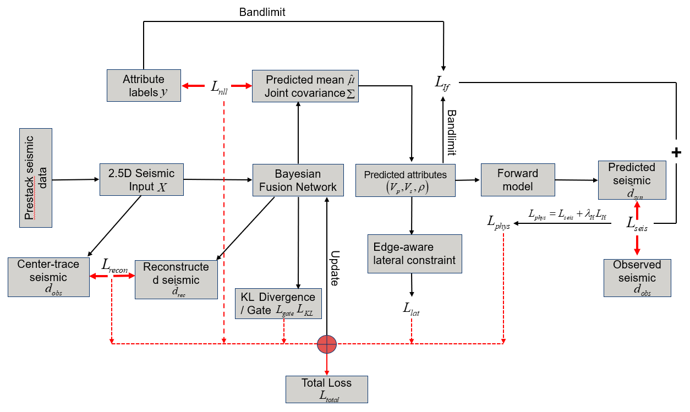
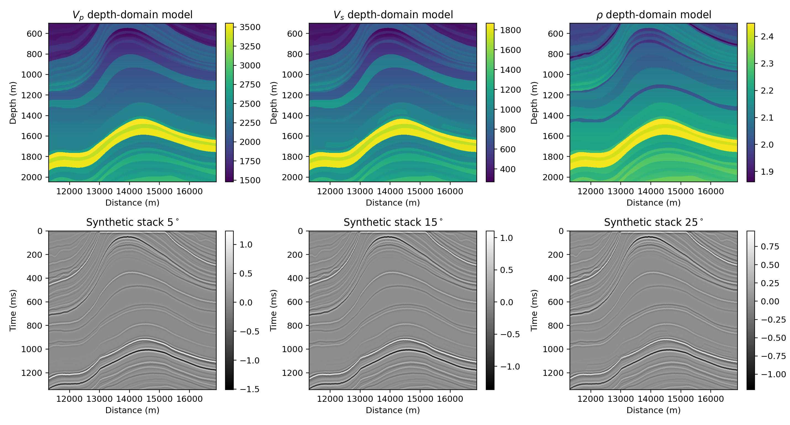
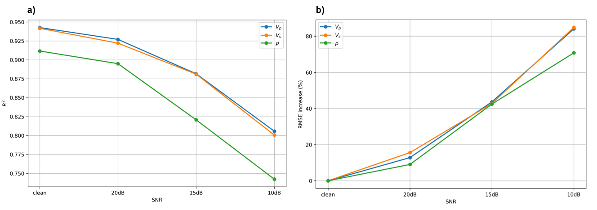

## Prestack-Probabilistic-Inversion-JCMPC

Code implementation for the paper "Joint-Covariance-Guided Prestack Probabilistic Inversion of Elastic Parameters with Physics Constraints". This repository contains the data-preparation scripts, prestack probabilistic inversion code, noise robustness testing code, processed Marmousi2 model data, and result figures for reproducing the tests presented in the paper.

## Overview

This project aims to perform prestack multi-parameter probabilistic inversion of elastic parameters, including P-wave velocity ($V_p$), S-wave velocity ($V_s$), and density ($\rho$), from prestack seismic data. The proposed framework integrates joint covariance modeling and physics constraints to improve inversion accuracy, profile continuity, and uncertainty characterization.

<p align="center">
  
</p>

The code provides an example workflow based on the Marmousi2 model, including model cropping, prestack synthetic seismic-data generation, probabilistic inversion, prediction-result visualization, residual analysis, and noise robustness evaluation.

## Repository Structure

```text
Prestack-Probabilistic-Inversion-JCMPC/
│
├── marmousi2_crop.py
├── marmousi_test.py
├── marmousi_noise_test.py
├── README.md
│
├── figure/
│   ├── fig_1.png
│   ├── fig_2.png
│   ├── ...
│   └── fig_11.png
│
└── model data/
    ├── data_crop/
    │   ├── marmousi2_crop_aux.mat
    │   ├── marmousi2_crop_mod4d.mat
    │   └── marmousi2_crop_stack4d_35hz.mat
    │
    ├── vp_marmousi-ii.segy
    ├── vs_marmousi-ii.segy
    └── density_marmousi-ii.segy
```

## Code Description

The main scripts are listed below.

```text
marmousi2_crop.py
```

This script is used to crop and prepare the Marmousi2 elastic-parameter models and generate the auxiliary model files required for our inversion method.

```text
marmousi_test.py
```

This script is used to perform the prestack multi-parameter probabilistic inversion on the Marmousi2 model and generate prediction results, residual maps, validation plots, and related output files.

```text
marmousi_noise_test.py
```

This script is used to conduct noise robustness tests under different signal-to-noise ratio conditions.

## Data Description

The folder `model data/data_crop/` contains the processed Marmousi2 data used by the scripts, including:

```text
marmousi2_crop_aux.mat
marmousi2_crop_mod4d.mat
marmousi2_crop_stack4d_35hz.mat
```

These files contain the cropped Marmousi2 elastic-parameter models, time-domain models, prestack synthetic seismic data, angle information, wavelet information, and related sampling parameters.

The three large original SEG-Y files are:

```text
vp_marmousi-ii.segy
vs_marmousi-ii.segy
density_marmousi-ii.segy
```

The three large original Marmousi2 SEG-Y files are not included in this repository. Users can download these files from the Allied Geophysical Laboratories website:

```text
http://www.agl.uh.edu/downloads/downloads.htm
```

## Requirements

The scripts in this study were conducted on a workstation equipped with dual Intel Xeon Platinum 8173M CPUs, with 56 physical cores and 112 logical threads, and an NVIDIA GeForce RTX 3090 GPU with 24 GB VRAM.

The software environment used in this study was:

```text
Python 3.10
PyTorch
CUDA 12.2
NVIDIA GPU driver 535.54.03
NumPy
SciPy
Matplotlib
scikit-learn
h5py
```

An NVIDIA GPU is recommended for model training.

## Installation

Clone the repository:

```bash
git clone https://github.com/abbabb12581-rgb/Prestack-Probabilistic-Inversion-JCMPC.git
cd Prestack-Probabilistic-Inversion-JCMPC
```

Create a Python environment:

```bash
conda create -n prestack_jcmpc python=3.10
conda activate prestack_jcmpc
```

Install the required packages:

```bash
pip install numpy scipy matplotlib scikit-learn h5py
pip install torch torchvision torchaudio
```

Please install the PyTorch version that matches your CUDA environment.

## Usage

### 1. Data preparation

If the processed .mat files are already available in model data/data_crop/, this step can be skipped.

To prepare the cropped Marmousi2 data from the original SEG-Y files, run:

```bash
python marmousi2_crop.py
```

This script reads the original Marmousi2 SEG-Y files, crops the selected model region, converts the depth-domain elastic-parameter models into the required data format, and generates the auxiliary .mat files used in the subsequent prestack inversion.

The generated data include the cropped depth-domain models of P-wave velocity, S-wave velocity, and density, as well as synthetic prestack seismic responses at different incidence angles. These outputs are saved in model data/data_crop/.

Among these outputs, the cropped Marmousi2 elastic-parameter models and synthetic prestack seismic data are shown in figure/fig_1.png.
<p align="center">
  
</p>

### 2. Inversion method

Run the prestack probabilistic inversion script:

```bash
python marmousi_test.py
```

This script performs model training, prestack multi-parameter probabilistic inversion, prediction-result visualization, validation, and residual analysis. The inversion target includes P-wave velocity, S-wave velocity, and density.

The main outputs include predicted elastic-parameter profiles, validation-well comparison results, residual maps, Q-Q plots, joint-distribution visualizations, and quantitative evaluation metrics such as correlation coefficient, RMSE, MAE, and ($R^2$).

Among these outputs, the predicted elastic-parameter profiles are shown in figure/fig_3.png.
<p align="center">
  
</p>

### 3. Noise robustness test

Run the noise robustness test script:

```bash
python marmousi_noise_test.py
```

This script evaluates the robustness of the proposed method under different noise levels. Noisy prestack seismic data are generated by adding noise with specified signal-to-noise ratios, and the inversion performance is then compared with the clean-data case.

The script outputs prediction metrics under each noise level and saves the noise robustness summary data in .mat format. The summary data can then be used to plot the noise robustness curves shown in figure/fig_2.png.
<p align="center">
  
</p>

## Output Files

The scripts generate prediction figures, residual figures, validation-well profiles, joint-distribution plots, training curves, and saved result files.

Typical outputs include:

```text
prediction profiles
residual profiles
validation-well profiles
training curves
noise robustness results
npz result files
json metric files
```

The generated figures can be used for manuscript visualization and result analysis.

## Computer Code Availability

Name of code/library: Prestack-Probabilistic-Inversion-JCMPC

Developer: Bingbing Zhu

Contact: [18921790664@163.com](mailto:18921790664@163.com)

Hardware requirements: The test scripts were conducted on a workstation equipped with dual Intel Xeon Platinum 8173M CPUs, with 56 physical cores and 112 logical threads, and an NVIDIA GeForce RTX 3090 GPU with 24 GB VRAM.

Software requirements: Python 3.10, PyTorch, CUDA 12.2, and NVIDIA GPU driver version 535.54.03.

Program language: Python

Program size: 370 KB

Availability: The source code is available at https://github.com/abbabb12581-rgb/Prestack-Probabilistic-Inversion-JCMPC.git


## Notes

This repository is intended for academic research and reproducibility. Users may need to modify local file paths, data paths, and GPU settings according to their own computing environment.

Large SEG-Y model files should be downloaded separately from the Allied Geophysical Laboratories website and placed in the `model data/` directory before running the data-preparation script.

## Contact

For questions or further information, please contact:

```text
Bingbing Zhu
Email: 18921790664@163.com
```
